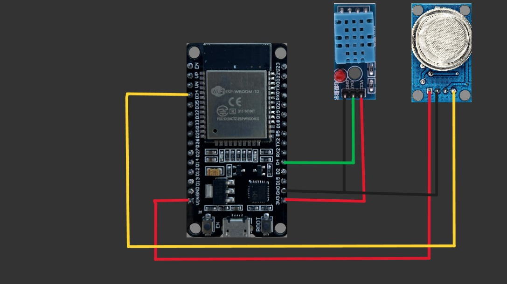
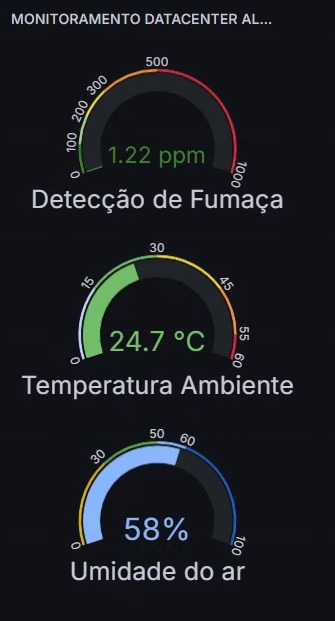

# 🌍 Sistema de Monitoramento Ambiental com ESP32 + InfluxDB + Grafana

🚀 **Projeto de IoT** para monitoramento de temperatura, umidade e
fumaça em ambientes críticos (como datacenters e CPDs).\
O sistema utiliza **ESP32 + DHT11 + MQ-135**, enviando os dados para o
**InfluxDB** e exibindo dashboards em tempo real no **Grafana**.

🔒 **Diferencial:** compatível com redes Wi-Fi que utilizam
**autenticação via endereço MAC**, dispensando captive portals ou
autenticação manual.

------------------------------------------------------------------------

## 📸 Visão Geral

O projeto utiliza:\
- **ESP32** para coleta de dados ambientais\
- **DHT11** para leitura de temperatura e umidade\
- **MQ-135** para detectar fumaça/gases\
- **InfluxDB** para armazenar os dados\
- **Grafana** para visualização em dashboards\
- **Docker Compose** para instalação e configuração

------------------------------------------------------------------------

## 🧰 Requisitos

### Hardware

-   ESP32 DevKit\
-   Sensor DHT11\
-   Sensor MQ-135\
-   Jumpers / Protoboard\
-   Conexão Wi-Fi (sem captive portal, apenas whitelist por MAC)

### Software

-   Arduino IDE (Windows/Linux)\
-   Docker + Docker Compose\
-   Bibliotecas Arduino:
    -   `WiFi.h` (inclusa no ESP32)\
    -   `DHT.h` (Adafruit)\
    -   `InfluxDbClient.h`\
    -   `InfluxDbCloud.h`

------------------------------------------------------------------------

## 💻 Instalação da Arduino IDE

### Linux (Ubuntu/Debian)

``` bash
sudo apt update
sudo apt install arduino
```

Ou baixe do site oficial 👉 [Arduino
IDE](https://www.arduino.cc/en/software)

### Windows

1.  Baixe o instalador: [Arduino
    IDE](https://www.arduino.cc/en/software)\
2.  Execute e siga os passos\
3.  Instale os drivers do ESP32, se necessário

------------------------------------------------------------------------

## ⚙️ Configuração da IDE Arduino

### Adicionando suporte ao ESP32

1.  Vá em **Arquivo \> Preferências**\

2.  Em **URLs adicionais para Gerenciadores de Placas**, adicione:

        https://raw.githubusercontent.com/espressif/arduino-esp32/gh-pages/package_esp32_index.json

3.  Vá em **Ferramentas \> Placa \> Gerenciador de Placas**, busque por
    *esp32* e instale

### Bibliotecas necessárias

Vá em **Ferramentas \> Gerenciar Bibliotecas** e instale:\
- **DHT sensor library** (Adafruit)\
- **InfluxDbClient** (by InfluxData)

------------------------------------------------------------------------

## 🔌 Esquema de Ligações

  Componente           Pino ESP32
  -------------------- ---------------------
  DHT11                GPIO 4
  MQ-135               GPIO 34 (analógico)
  VCC (DHT e MQ-135)   3.3V
  GND                  GND

📷 

------------------------------------------------------------------------

## 🔧 Configuração do Código

Edite no código Arduino:

``` cpp
#define WIFI_SSID "SUA_REDE_WIFI"
#define WIFI_PASSWORD "SENHA_WIFI"

#define INFLUXDB_URL "http://SEU_SERVIDOR_INFLUXDB:8086"
#define INFLUXDB_TOKEN "SEU_TOKEN"
#define INFLUXDB_ORG "SUA_ORGANIZACAO"
#define INFLUXDB_BUCKET "NOME_DO_BUCKET"
```

### Upload para o ESP32

1.  Conecte o ESP32 via USB\
2.  Vá em **Ferramentas \> Placa** e selecione *ESP32 Dev Module*\
3.  Em **Ferramentas \> Porta**, selecione a porta correta (ex: COM3 ou
    /dev/ttyUSB0)\
4.  Clique em **Upload**

------------------------------------------------------------------------

## 🗃️ Configuração do InfluxDB + Grafana com Docker Compose

### 1. Instalar Docker e Docker Compose

**Linux (Ubuntu/Debian):**

``` bash
sudo apt update
sudo apt install docker.io docker-compose -y
sudo systemctl enable docker
sudo systemctl start docker
```

**Windows:**\
👉 Baixe o [Docker
Desktop](https://www.docker.com/products/docker-desktop)

### 2. Criar `docker-compose.yml`

``` yaml
version: '3.8'

services:
  influxdb:
    image: influxdb:2.7
    container_name: influxdb
    restart: unless-stopped
    ports:
      - "8086:8086"
    volumes:
      - influxdb-data:/var/lib/influxdb2
    environment:
      - DOCKER_INFLUXDB_INIT_MODE=setup
      - DOCKER_INFLUXDB_INIT_USERNAME=admin
      - DOCKER_INFLUXDB_INIT_PASSWORD=admin123
      - DOCKER_INFLUXDB_INIT_ORG=my-org
      - DOCKER_INFLUXDB_INIT_BUCKET=sensores
      - DOCKER_INFLUXDB_INIT_ADMIN_TOKEN=meu-token-secreto

  grafana:
    image: grafana/grafana:latest
    container_name: grafana
    restart: unless-stopped
    ports:
      - "3000:3000"
    volumes:
      - grafana-data:/var/lib/grafana
    environment:
      - GF_SECURITY_ADMIN_USER=admin
      - GF_SECURITY_ADMIN_PASSWORD=admin123
    depends_on:
      - influxdb

volumes:
  influxdb-data:
  grafana-data:
```

### 3. Subir os containers

``` bash
docker compose up -d
```

### 4. Acesso

-   **InfluxDB:** http://localhost:8086\
-   **Grafana:** http://localhost:3000

------------------------------------------------------------------------

## 📡 Autenticação por MAC Address

Exemplo de código para descobrir o MAC do ESP32:

``` cpp
#include <WiFi.h>

void setup() {
  Serial.begin(115200);
  Serial.println(WiFi.macAddress());
}

void loop() {}
```

Abra o monitor serial e copie o MAC para cadastrar no Access Point.

------------------------------------------------------------------------

## 🧪 Exemplo de Saída Serial

    Conectando-se ao Wi-Fi...
    Conectado!
    ✅ Conectado ao InfluxDB!
    🌡️ Temp: 25.40°C | 💧 Umid: 61.20% | 🔥 Fumaça: 350.12 ppm
    ✅ Dados enviados ao InfluxDB!

------------------------------------------------------------------------

## 📈 Visualização com Grafana

No Grafana, configure o InfluxDB como **Data Source** e crie gráficos em
tempo real de temperatura, umidade e fumaça.

📊 

------------------------------------------------------------------------

## ✅ Conclusão

Este projeto permite monitorar remotamente ambientes críticos como
datacenters, salas técnicas e CPDs, **sem necessidade de autenticação
manual**, utilizando apenas whitelist de MAC Address.
